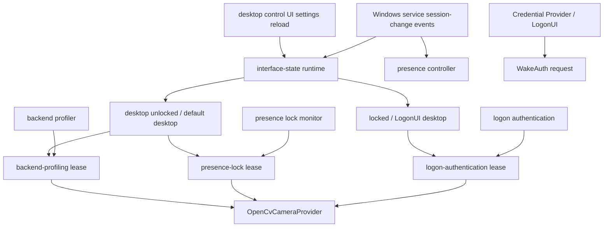

# Camera backend profiling

## Problem

`opencv-index:N` only identifies a camera index. OpenCV still needs a Windows capture backend:
`msmf`, `dshow`, or `any`. On real hardware these can differ by tens of seconds. The service
must not discover this during enrollment or unlock.

## Decision

The Windows service owns camera backend profiling.

- On service startup, profile all currently visible cameras in the background.
- On camera device changes, profile again in the background.
- Store the fastest readable backend per camera in an install-local JSON file.
- Enrollment, presence monitoring, and unlock use the stored backend before fallback probing.
- If a stored backend fails, the normal fallback still works and the profiler refreshes later.

The profile file is a camera-management contract, not a hard-coded setting owned
by any one feature. Face enrollment, unlock authentication, presence lock, and
diagnostic commands must ask the same camera-management layer for the runtime
camera configuration instead of each feature choosing OpenCV backends directly.

The profiler must not let a transient bad probe overwrite a known-good profile.
For example, if `dshow` previously opened a C920 in about 200 ms, a later probe
where only `any` succeeds after 23 seconds is degraded evidence. It should be
logged and ignored as a preferred backend unless no acceptable profile exists
and a caller explicitly falls back during camera open.

## Storage

Path:

`<install-dir>\config\camera_backend_profiles.json`

Shape:

```json
{
  "profiles": [
    {
      "camera_id": "opencv-index:1",
      "display_name": "Logitech HD Pro Webcam C920",
      "preferred_backend": "dshow",
      "open_ms": 640,
      "read_ms": 101,
      "frame_width": 640,
      "frame_height": 480,
      "measured_at_unix_ms": 1781940000000,
      "last_probe_status": "usable",
      "last_probe_reason": "fastest-readable-backend"
    }
  ]
}
```

`camera_id` is the initial key because the current provider contract is index-based. `display_name`
is stored as a weak device signature so later device-path support can replace the key without
changing users' saved preference semantics.

## Runtime Flow

1. Service starts.
2. `CameraBackendProfileService` enumerates cameras without opening streams.
3. For each camera, it measures `msmf`, `dshow`, and `any`.
4. It writes the fastest backend that opens and returns a non-empty first frame.
5. `OpenCvCameraProvider` reads `preferred_backend` from config and tries it first.
6. If no profile exists, it uses fallback order.
7. Windows device change notification triggers another profiling pass.

The refresh merge policy is:

1. Probe all candidate backends: `msmf`, `dshow`, and `any`.
2. Pick the fastest readable candidate.
3. Accept the candidate as preferred only when `open_ms` is within the usable
   threshold.
4. If the candidate is too slow and an existing usable profile exists, keep the
   existing profile.
5. If both the candidate and existing profile are degraded, do not expose either
   as a preferred backend; callers should use the provider fallback order.
6. Log whether the profile was updated, kept, skipped, or degraded, including
   old and new backend/timing data.

The first implementation uses a conservative 3000 ms usable threshold. This is
not a product promise; it is a guardrail that prevents a 20+ second backend from
becoming the long-lived preferred path.

## Camera Runtime Boundary

Business modules should depend on a resolved camera runtime configuration:

```text
camera_id
preferred_backend
requested_frame_width
requested_frame_height
fallback backend order
```

The ownership boundary is:

```text
face enrollment / unlock / presence / diagnostics
  -> request a camera runtime config
camera backend profile service
  -> owns profiling, profile persistence, degradation policy, and logs
OpenCvCameraProvider
  -> owns the platform adapter and final fallback attempts
```

This keeps feature code from embedding camera-backend policy and makes future
device-path based camera IDs or exclusive camera leases possible without
rewriting every feature.

## Interface State And Camera Lease Runtime

The service owns a single interface-state and camera-lease runtime. Feature
modules must not open the camera just because they have a camera id. They must
first acquire a lease from the runtime.



Interface-state source:

- `desktop unlocked` is set only by trusted service-side lifecycle events:
  `SessionLogon`, `SessionUnlock`, or an explicit desktop control settings
  reload.
- `locked / LogonUI` is set by `SessionLock`, `SessionLogoff`,
  `ConsoleDisconnect`, `RemoteDisconnect`, and `SessionTerminate`.
- `unknown` is the startup state and is fail-closed for background camera
  consumers.
- `active_user_session_id()` is not a lock-state source. It is only a session
  existence helper for deciding which user session a desktop control reload can
  target.
- The service must not use `OpenInputDesktop` as the state source. The service
  runs as LocalSystem in Session 0, so the input desktop observed from that
  process is not a reliable proxy for the interactive user's lock/unlock state.

Lease rules:

- `locked / LogonUI` allows only logon authentication to open the camera.
- `desktop unlocked` allows presence lock monitoring and backend profiling.
- backend profiling runs only when the desktop is unlocked and no other camera
  lease exists.
- `unknown` allows only logon authentication. This keeps LogonUI unlock usable
  when the service cannot query the input desktop, while preventing background
  desktop tasks from taking the camera during ambiguous states.
- logon authentication may wait briefly for an in-flight camera holder to drop;
  presence monitoring and profiling should not wait and should yield instead.

Implementation boundary:

- `camera_runtime` owns interface-state detection, lease arbitration, and lease
  release.
- `service_host` treats session-change events as presence monitor start/stop
  triggers and updates `camera_runtime` before the presence command is sent.
- desktop control settings reloads are allowed to mark the runtime as desktop
  unlocked because that request is initiated from the interactive desktop UI.
- `auth_issuer`, `presence_camera`, `presence_person_camera`, and
  `camera_backend_profiles` must acquire a lease before creating or opening
  `OpenCvCameraProvider` / `VideoCapture`.
- A lease is released by `Drop`; long-running presence sources hold a lease for
  their source lifetime, short one-shot users hold it only while the camera is
  open.

## Observability

Service log records:

- profiling start/completion
- per-camera selected backend and timing
- probe failures
- degraded probe candidates that were not persisted as preferred
- cases where an existing good profile was kept
- cases where an existing bad profile was ignored or removed
- device-change-triggered refresh

No credentials or frame image data are logged.

## Test Strategy

- Unit test JSON read/write selection.
- Unit test backend ordering uses profile first.
- Manual diagnostic command: `camera-open-benchmark`.
