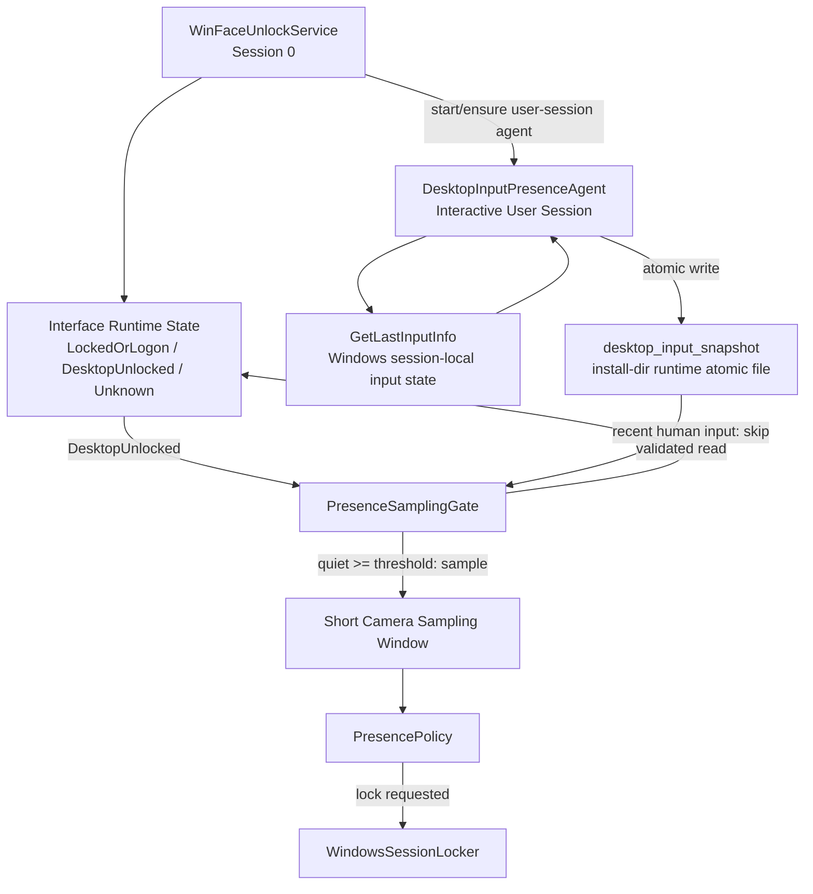

# Desktop Input Presence And Usage Audit Plan

## 背景

WinFaceUnlock 当前有两类容易混淆但必须分开的需求：

1. 离座落锁需要判断用户最近是否有键盘或鼠标输入，从而决定是否需要短暂打开摄像头采样。
2. 未来可能需要做本机使用审计，用于记录他人使用本机时发生过哪些可观察操作。

这两个能力都和桌面输入有关，但它们的职责、数据粒度、权限边界和隐私风险不同。离座检测只需要“最近是否有人操作”，不需要输入内容；使用审计应作为独立模块设计，不能混入 Presence Lock 的实时锁屏主链路。

## 目标

1. 修复 Windows Service 在 Session 0 中读取键鼠状态不可信的问题。
2. 为 Presence Lock 提供可信的桌面会话键鼠静默时间。
3. 保持摄像头低频、短窗口采样：最近有人输入时不拉起摄像头，超过阈值静默后才采样。
4. 为未来使用审计预留独立模块边界和数据契约。
5. 明确 Raw Input、GetLastInputInfo、Hook 等输入技术路线的适用范围。

## 非目标

1. Presence Lock 不记录键盘输入内容。
2. Presence Lock 不记录鼠标坐标或点击目标。
3. Presence Lock 不依赖前台窗口、视频播放或媒体会话作为第一版判定条件。
4. 使用审计不进入当前阶段交付范围。
5. 使用审计不作为登录认证、凭据解密或摄像头租约判定的依赖。

## 术语

`DesktopInputPresenceAgent`
  运行在当前交互式用户桌面 Session 的轻量输入状态探针。它只输出键鼠最近输入时间或静默时长。

`DesktopUsageAuditAgent`
  未来可选的桌面使用审计模块。它记录可配置的操作事件，不参与 Presence Lock 的摄像头采样决策。

`human_input_quiet_duration_ms`
  从当前桌面 Session 最近一次键盘或鼠标输入到当前时刻的时长。

`desktop_input_snapshot`
  `DesktopInputPresenceAgent` 写出的结构化输入状态快照。

## 当前离座检测方案

### 技术选择

第一版使用 Windows 原生 `GetLastInputInfo`。

该 API 返回调用进程所在 Session 的最后输入时间，因此必须在当前用户桌面 Session 中调用。Windows Service 位于 Session 0，直接调用该 API 会读取服务会话的输入状态，不能代表当前桌面用户的键鼠活动。

因此实现方向是：

```text
WinFaceUnlockService(Session 0)
  -> 识别当前交互式桌面 Session
  -> 启动或维护 DesktopInputPresenceAgent
  -> 读取 agent 写出的 desktop_input_snapshot
  -> PresenceSamplingGate 根据快照决定是否打开摄像头
```

### 架构图



### 快照契约

建议路径：

```text
<install_dir>\runtime\desktop-input-state.json
```

字段：

```json
{
  "schema_version": 1,
  "source": "interactive-session-get-last-input-info",
  "session_id": 1,
  "agent_process_id": 1234,
  "last_input_tick_ms": 123456789,
  "human_input_quiet_duration_ms": 12000,
  "sampled_at_unix_ms": 1782040000000
}
```

字段语义：

| 字段 | 含义 |
| --- | --- |
| `schema_version` | 快照格式版本 |
| `source` | 输入状态来源，第一版固定为 `interactive-session-get-last-input-info` |
| `session_id` | 产生快照的用户桌面 Session |
| `agent_process_id` | 写入快照的 agent 进程 ID，用于日志排查 |
| `last_input_tick_ms` | Windows tick 口径下的最近输入时间 |
| `human_input_quiet_duration_ms` | 最近键鼠输入距采样时刻的静默时长 |
| `sampled_at_unix_ms` | 快照写入时的 wall-clock 时间 |

快照写入必须使用临时文件加原子替换，避免服务读到半写入内容。

### 门控策略

默认配置：

```text
human_input_quiet_threshold_ms = 60_000
desktop_input_snapshot_max_age_ms = 15_000
presence_gate_recheck_interval_ms = 60_000
desktop_input_agent_sample_interval_ms = 5_000
```

解释：

1. Agent 每 5 秒刷新一次输入状态快照。该操作只是读取系统最后输入时间，不打开摄像头，也不记录输入内容。
2. PresenceSamplingGate 每 60 秒做一次离座采样决策。
3. 最近 60 秒内有键鼠输入时跳过摄像头。
4. 超过 60 秒没有键鼠输入时，才允许短暂打开摄像头采样。
5. 快照过期、Session 不匹配或解析失败时，默认不打开摄像头，并记录输入状态不可信日志。

伪代码：

```text
snapshot = read_desktop_input_snapshot()

if snapshot missing:
    skip camera sampling
    log reason=input-snapshot-missing

if snapshot.session_id != current_desktop_session_id:
    skip camera sampling
    log reason=input-snapshot-session-mismatch

if snapshot age > desktop_input_snapshot_max_age_ms:
    skip camera sampling
    log reason=input-snapshot-stale

if snapshot.human_input_quiet_duration_ms < human_input_quiet_threshold_ms:
    skip camera sampling
    log reason=recent-human-input

allow short camera sampling
log reason=human-input-quiet
```

### 日志要求

Agent 写入：

```text
DesktopInputPresenceAgent.SnapshotWritten
  session_id=...
  human_input_quiet_duration_ms=...
  sampled_at_unix_ms=...
```

服务读取：

```text
PresenceSamplingGate.SkipSampling
  reason=recent-human-input
  session_id=...
  human_input_quiet_duration_ms=...
  human_input_quiet_threshold_ms=...
```

异常：

```text
PresenceSamplingGate.SkipSampling
  reason=input-snapshot-missing

PresenceSamplingGate.SkipSampling
  reason=input-snapshot-stale
  snapshot_age_ms=...
  snapshot_max_age_ms=...

PresenceSamplingGate.SkipSampling
  reason=input-snapshot-session-mismatch
  snapshot_session_id=...
  current_session_id=...
```

允许采样：

```text
PresenceSamplingGate.AllowSampling
  reason=human-input-quiet
  session_id=...
  human_input_quiet_duration_ms=...
  human_input_quiet_threshold_ms=...
```

## 输入技术路线对比

| 技术 | 作用 | 优点 | 风险 / 限制 | 当前定位 |
| --- | --- | --- | --- | --- |
| `GetLastInputInfo` | 查询当前 Session 最后键鼠输入时间 | Windows 原生、轻量、语义正好 | 必须在交互式用户 Session 中调用 | Presence Lock 第一版主方案 |
| Raw Input / `WM_INPUT` | 接收键盘鼠标 HID 原始输入事件 | 可区分设备，事件粒度细 | 需要窗口消息循环，数据粒度更敏感 | 未来审计或活动强度统计的可选来源 |
| Low Level Hook | 低级键鼠事件 hook | 可捕获事件流 | 易受超时、消息循环、完整性级别影响，维护风险高 | 不作为当前主方案 |
| WTS Session API | 查询活动 Session 和会话状态 | 适合服务找到用户 Session | 不提供最终键鼠输入内容或静默时长 | Service 启动 agent 的辅助能力 |

## 未来使用审计预留

未来审计应作为 `DesktopUsageAuditAgent` 单独设计，不复用 Presence Lock 的门控模块。

可预留事件模型：

```json
{
  "schema_version": 1,
  "event_id": "uuid",
  "event_type": "foreground_window_changed",
  "session_id": 1,
  "occurred_at_unix_ms": 1782040000000,
  "actor_context": {
    "windows_user_sid": "S-1-5-21-...",
    "is_owner_session": true
  },
  "details": {
    "process_name": "chrome.exe",
    "window_title": "example"
  }
}
```

候选事件类型：

```text
session_logon
session_unlock
session_lock
session_logoff
foreground_window_changed
process_started
process_exited
usb_device_arrived
usb_device_removed
file_access_observed
file_change_observed
human_input_activity_summary
unknown_face_observed
screen_snapshot_captured
```

`human_input_activity_summary` 只用于描述活动强度，例如：

```json
{
  "event_type": "human_input_activity_summary",
  "details": {
    "keyboard_event_count": 42,
    "mouse_event_count": 318,
    "interval_ms": 60000
  }
}
```

未来如果接入 Raw Input，应优先作为活动强度、设备来源和时间线信号，而不是 Presence Lock 的必需依赖。

## 模块边界

```text
crates/desktop_input_agent
  当前阶段新增。用户桌面 Session 输入状态探针。

crates/win_service/src/presence_sampling_gate.rs
  消费 desktop_input_snapshot，决定是否允许摄像头短采样。

crates/win_service/src/desktop_input_state.rs
  读取、校验、解析 desktop_input_snapshot。

crates/win_service/src/desktop_agent_launcher.rs
  通过 Windows Session / Token API 启动或维护 DesktopInputPresenceAgent。

future: crates/desktop_usage_audit_agent
  未来审计 agent，不进入当前阶段。

future: crates/usage_audit_store
  未来审计事件加密存储、查询和清理策略。
```

## 验收标准

当前阶段：

1. 用户在桌面移动鼠标或敲键盘后，服务日志显示 `reason=recent-human-input`。
2. 最近 60 秒内有键鼠输入时，服务不打开摄像头。
3. 超过 60 秒无键鼠输入后，服务才允许一次短采样窗口。
4. 快照过期、Session 不匹配或 agent 不可用时，服务不打开摄像头，并输出明确日志。
5. 锁屏态 / LogonUI 态不运行 Presence Lock 采样门控。
6. 安装包包含 `DesktopInputPresenceAgent`，安装后服务和 agent 版本一致。

未来审计阶段：

1. 审计模块独立于 Presence Lock。
2. 审计事件使用结构化 schema 和版本号。
3. 审计存储有加密、保留期限和清理策略。
4. 审计开关、事件类型、采集粒度均可配置。
5. Raw Input 如果接入，只作为审计 agent 的可选输入源，不影响当前离座锁屏主链路。

## 实施顺序

1. 新增 `DesktopInputPresenceAgent`，只实现 `GetLastInputInfo` 快照写入。
2. 新增服务侧快照读取和校验模块。
3. 修改 `PresenceSamplingGate`：从快照读取输入状态，不再在服务 Session 0 中直接调用 `GetLastInputInfo`。
4. 修改 Presence controller：桌面解锁态启动或确认 agent；锁屏 / 注销时不继续依赖该 agent。
5. 补单元测试：recent input、quiet input、stale snapshot、session mismatch。
6. 做真实服务验证：活动时不拉摄像头，静默 60 秒后短采样。
7. 重构 setup package，确保安装包包含新 agent 和最新服务二进制。
