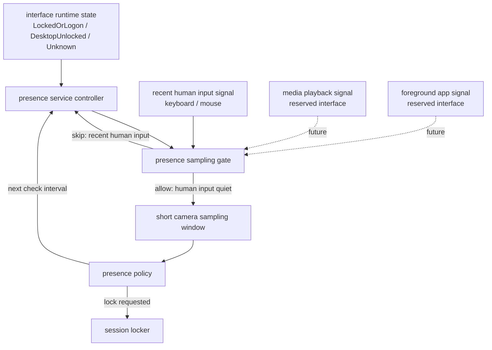

# Presence Lock Sampling Gate Architecture

## 背景

Presence Lock 离座落锁只属于用户已经登录桌面后的安全保持链路。它不参与
LogonUI 登录认证，不签发 `AuthGrant`，也不读取或提交 Windows 凭据。

锁屏态 / 桌面态状态机只负责判别当前哪条业务链路有资格申请摄像头：

- `LockedOrLogon`：只允许登录认证链路申请摄像头。
- `DesktopUnlocked`：允许离座落锁链路在需要采样时申请摄像头。
- `Unknown`：后台桌面任务 fail-closed，避免状态不明时占用摄像头。

这个状态机不是摄像头开关。进入 `DesktopUnlocked` 不代表摄像头应常开。

## 目标

1. 离座落锁只在桌面态运行策略控制器。
2. 摄像头只在采样门控允许时短暂打开，采完立即释放。
3. 键鼠近期输入作为第一版稳定的人类输入信号。
4. 媒体播放、前台应用等更复杂信号先预留接口，不进入第一版核心实现。
5. 日志必须能解释每一轮为什么没有打开摄像头、为什么打开、以及采样结果。

## 非目标

1. 不把键鼠输入当成“用户一定在场”的长期豁免条件。
2. 不把视频播放直接当成人在场。
3. 不做持续视频录制。
4. 不让 Presence Lock 的低阈值结果放行登录。
5. 不让具体检测模型持有系统状态机职责。

## 命名约束

禁止使用容易混淆的裸名：

```text
active
idle
success
ok
flag
```

第一版键鼠输入门控使用明确语义：

```text
recent_human_input_detected
human_input_quiet_duration_ms
human_input_quiet_threshold_ms
```

这些名字只描述键盘 / 鼠标输入，不描述窗口 active、session active、服务
running、monitor active 或桌面状态。

## 分层架构



## 数据所有权

`camera_runtime`
  拥有锁屏态 / 桌面态状态、摄像头租约仲裁和租约释放。

`presence_service`
  拥有桌面会话生命周期、Presence Monitor 启停、采样循环编排。

`presence_sampling_gate`
  拥有“本轮是否需要打开摄像头”的判定。第一版只读取键鼠输入静默时间。

`presence_person_camera` / `presence_camera`
  只负责一次短采样窗口内的摄像头打开、读取、检测和释放。

`presence_policy`
  只消费结构化 observation，维护离座状态机和下一次检查间隔。

## 第一版门控策略

配置默认值：

```text
human_input_quiet_threshold_ms = 60_000
```

门控规则：

```text
if recent_human_input_detected:
    skip camera sampling
    schedule next lightweight gate check

if human_input_quiet_duration_ms >= human_input_quiet_threshold_ms:
    allow short camera sampling window
```

解释：

- 最近 60 秒内有键鼠输入时，不打开摄像头。
- 超过 60 秒没有键鼠输入时，短暂打开摄像头看一眼。
- 如果人在看视频但没有键鼠输入，超过 60 秒后仍会短暂采样；人在则不锁，人不在则锁。

## 摄像头短采样窗口

Presence camera source 不应跨多轮 policy 检查长期持有摄像头租约。

每次采样窗口必须遵守：

1. 尝试获取 `PresenceLock` 摄像头租约。
2. 打开摄像头。
3. 读取有限帧数或有限时间。
4. 产出一次 `PresenceObservation`。
5. 关闭摄像头并释放租约。

短采样窗口内可以容忍刚打开摄像头时的瞬时坏帧：

```text
EmptyFrame
ReadFailed
InvalidFrame
```

这些错误可以在窗口内跳过若干帧，但不能让摄像头跨窗口常驻。

## 媒体播放预留接口

媒体播放不进入第一版 gating 决策，但预留信号字段：

```text
media_playback_detected
media_signal_confidence
media_signal_source
```

未来候选实现：

- Windows 音频会话：可发现进程正在输出音频，但无法覆盖静音视频。
- 系统媒体传输控制 / WinRT：可发现部分媒体会话，但覆盖不保证完整。
- 前台窗口和进程类别：实现简单，但只能作为弱信号。
- 浏览器扩展或客户端协作：更准确，但侵入性更高。

媒体播放即使接入，也只能影响采样节奏，不能成为永远不采样的安全豁免。

## 日志要求

每轮门控至少记录：

```text
PresenceSamplingGate.SkipSampling
  reason=recent-human-input
  human_input_quiet_duration_ms=...
  human_input_quiet_threshold_ms=...

PresenceSamplingGate.AllowSampling
  reason=human-input-quiet
  human_input_quiet_duration_ms=...
  human_input_quiet_threshold_ms=...
```

采样窗口至少记录：

```text
PresencePersonSource.SampleStarted
PresencePersonSource.LeaseAcquired
PresencePersonSource.OpenCameraSucceeded
PresencePersonSource.SampleCompleted
PresencePersonSource.SampleReleased
```

故障必须区分：

```text
gate-signal-unavailable
camera-lease-denied
camera-open-failed
transient-frame-skipped
transient-frame-escalated
detector-failed
```

## 验收标准

1. 桌面解锁后，Presence controller 可以运行，但摄像头不应立即常驻。
2. 最近键鼠输入 60 秒内，不打开摄像头。
3. 键鼠输入静默超过阈值后，只打开短采样窗口。
4. 每个采样窗口结束后释放摄像头租约。
5. 锁屏 / 注销 / 断开会停止 Presence controller 并释放资源。
6. 登录认证和离座落锁不会同时持有摄像头。
